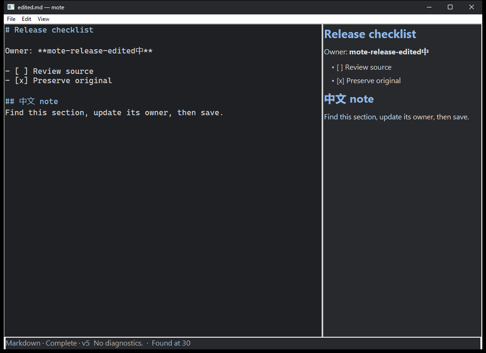
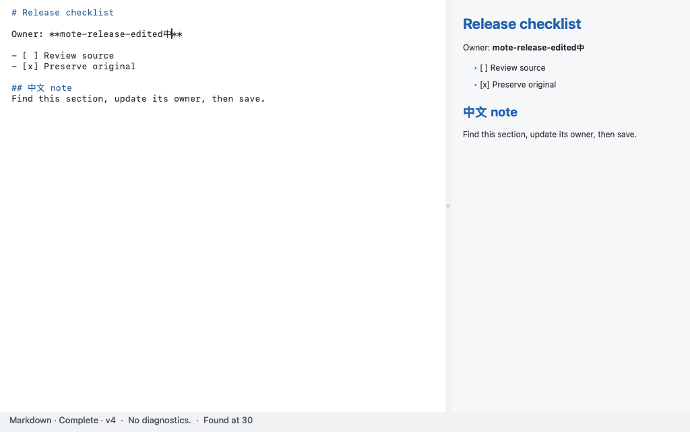

# v0.1.0 — native single-document editing

**Version: 0.1.0. Published: 2026-10-02 07:10:43 Asia/Singapore
(2026-10-01 23:10:43 UTC). Tag: `v0.1.0`.**
The [public GitHub release](https://github.com/kleedaisuki/mote/releases/tag/v0.1.0)
is available. Its annotated tag targets
[`ed96fe4f29278e633e10421c89e2ce1f5b0536ae`](https://github.com/kleedaisuki/mote/commit/ed96fe4f29278e633e10421c89e2ce1f5b0536ae).
All 11 public assets were downloaded without authentication and matched the
bytes qualified by the final release workflow. This repository page includes
post-publication evidence; the manuals inside tagged packages remain immutable.

mote opens one document without opening a workspace. This release is intended
for ordinary structured-text editing and few-MiB reading, with Native AOT
packages that do not require users to install .NET. Multiple-file application
packages are allowed; the single-document product model is unchanged.

## Release assets

Package names and entry points are listed below. Consult
[the v0.1.0 GitHub release](https://github.com/kleedaisuki/mote/releases/tag/v0.1.0)
for available downloads and their verification records.

| Asset | Computer | Package entry point |
| --- | --- | --- |
| [mote-0.1.0-win-x64.zip](https://github.com/kleedaisuki/mote/releases/download/v0.1.0/mote-0.1.0-win-x64.zip) | Intel/AMD Windows | `mote.exe` |
| [mote-0.1.0-win-arm64.zip](https://github.com/kleedaisuki/mote/releases/download/v0.1.0/mote-0.1.0-win-arm64.zip) | Arm Windows | `mote.exe` |
| [mote-0.1.0-osx-x64.tar.gz](https://github.com/kleedaisuki/mote/releases/download/v0.1.0/mote-0.1.0-osx-x64.tar.gz) | Intel macOS | `mote.app/Contents/MacOS/mote` |
| [mote-0.1.0-osx-arm64.tar.gz](https://github.com/kleedaisuki/mote/releases/download/v0.1.0/mote-0.1.0-osx-arm64.tar.gz) | Apple silicon macOS | `mote.app/Contents/MacOS/mote` |

The declared support policy is currently supported Windows 11 releases and
macOS 15 or newer. Windows archives contain a versioned `mote-0.1.0-<rid>/`
directory; macOS archives contain `mote.app`. `SHA256SUMS`, per-package manifests,
[release-index.json](https://github.com/kleedaisuki/mote/releases/download/v0.1.0/release-index.json) and the
[matching source archive](https://github.com/kleedaisuki/mote/releases/download/v0.1.0/mote-0.1.0-source.tar.gz) accompany the downloads.
Verify archives using [SHA256SUMS](https://github.com/kleedaisuki/mote/releases/download/v0.1.0/SHA256SUMS).
The final package qualification reports record the actual tested OS versions.
Supported OS policy is not proof that every version was exercised. Native AOT
is retained; these are not CoreCLR/JIT packages or the Avalonia prototype.

## Build identity and qualification provenance

Release builds select .NET SDK **10.0.401**, with the corresponding Native AOT
runtime **10.0.12**. `global.json` disables SDK roll-forward; the release pipeline
also checks the actual selected SDK before publication. An installed SDK list or
`setup-dotnet` request alone is not sufficient provenance. This is a maintainer
build requirement, not a .NET installation requirement for application users.
The [.NET 10.0.12 servicing release](https://github.com/dotnet/core/blob/main/release-notes/10.0/10.0.12/10.0.12.md)
contains security fixes; runtime servicing is incorporated by rebuilding and
qualifying the mote executable, not by asking users to install a shared runtime.

The final per-package manifests record source commit, version, architecture,
selected SDK, workflow run, and payload lengths/SHA-256. `release-index.json`
and `SHA256SUMS` identify the assembled archives and matching source. Follow the
workflow identity in those manifests for the final package qualification; this
manual is not an independent immutable build-identity record. Earlier candidate
unit-test or AOT-build passes cannot be relabeled as final-package qualification.

## User-visible capabilities

- Default full-native source editing using Windows RichEdit or macOS NSTextView;
  explicit `--continuous` and `--legacy-page` retain prior presentation routes.
- One canonical editable document, explicit Open/New/Save/Save As and engine
  Undo/Redo, with whole-document Find and Go to Line.
- Markdown, TOML, JSON, YAML, CSV and plain-text policies; parsed structure,
  source diagnostics and bounded native previews.
- Conservative explicit formatting, strict Unicode and explicit Chinese legacy
  codec choices, rather than silent text replacement.
- Restrained dark/light/system/high-contrast-dark themes, validated color data
  overrides, and user-editable configuration under `~/.mote`.
- Relocatable data/cache/trace destinations and off-by-default local traces.
- Save conflict checks and explicit retained-snapshot recovery workflows.

See [the manual](../user/manual.md) for behavior and limits,
[installation](../user/installation.md) for native package setup, and
[configuration](../user/configuration.md) for actual setting names.

## Package qualification and its limits

[Final release workflow 36938529836](https://github.com/kleedaisuki/mote/actions/runs/36938529836)
completed all eight required jobs successfully for the exact tagged source.
Independent retained-evidence review verified **24 format tasks across four
architectures**, **36 GUI processes**, and **3,479 strict trace rows**, including
exact edited/Undo/Redo source, Save bytes and fresh-process reopen. Artifact review
verified ten checksum entries and the source archive against 888 Git blobs;
post-publication anonymous download review matched all 11 assets to those bytes.

Qualification used extracted release packages, actual SDK 10.0.401 and resolved
Core/runtime/Native AOT compiler packs 10.0.12. Selected SDK alone was not treated
as proof of the target AOT pack. The final per-package manifests preserve the
source/run identity and toolchain metadata hashes.

| Package | Actually exercised OS |
| --- | --- |
| Windows x64 | Windows build 26100 |
| Windows Arm64 | Windows build 26200 |
| macOS Intel | macOS 15.7.9 |
| macOS Apple silicon | macOS 26.6.2 |

These environments are evidence points, not a claim that every supported OS
version was executed. The required workflow additionally checked full solution
tests on Windows/macOS, package/oracle controls, extracted inventories, native
runtime/GUI startup, version/help, seven embedded codecs, local configuration/
theme routes, schema/privacy/session trace evidence and post-run payload hashes.

The final tag, release index and package manifests remain the immutable source/run
authority. Future repository edits do not retrospectively qualify new binaries;
changed products or runtime servicing require new package qualification.

The samples are self-created correctness tasks, not measured market demand or
a universal experience benchmark. Windows direct control messages and AppKit
programmatic changes do not prove physical keyboard delivery, real Pinyin
candidate interaction, attended NVDA/VoiceOver or display visibility. Hosted
launch does not certify Gatekeeper/SmartScreen acceptance. No latency percentile
or universal large-file guarantee is claimed.

## Captured product views

Windows x64: captured owned application window after the Markdown task's final
source/semantic publication in the qualified run.

macOS Arm64: captured application content view, **not the complete window chrome**,
after the same task's final publication. These are actual workflow captures, not
mockups, physical-display latency measurements, or IME/reader certifications.

## Known limitations for the release notes

- Unsigned Windows downloads can trigger SmartScreen. Unsigned/unnotarized macOS
  downloads can be blocked by Gatekeeper. Hosted launch is not trust acceptance.
- Provisional analysis is explicitly incomplete; dense/deep/large input may never
  obtain a globally Complete result under resource limits.
- Native text residency and long lines can be expensive. 100-MB stress behavior
  is capacity evidence, not ordinary-task performance acceptance.
- IME and attended screen-reader coverage must be stated per tested workflow,
  not inferred from the operating-system control, test count, or tree exposure.
- Save/recovery protects explicit snapshots but is not an autosave service,
  automatic crash-recovery catalog, or universal power-loss durability promise.
- The full-native source surface rejects unsafe embedded-NUL editing while
  retaining canonical text; it must not silently truncate the document.

## Release maintenance

Keep this page, [CHANGELOG](../../CHANGELOG.md), packaged manual, GitHub release
body and checksum record aligned to one tag. The
[maintainer checklist](https://github.com/kleedaisuki/mote/blob/main/docs/releases/README.md) defines the publication/update procedure.
